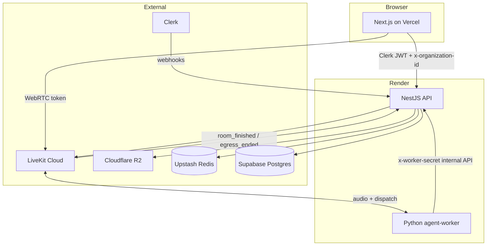
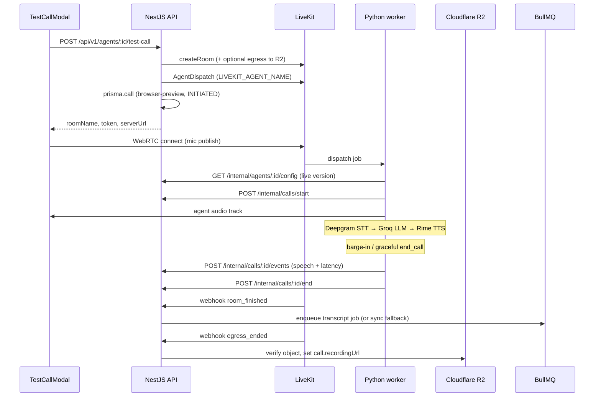

# Awaaz V1 — System Architecture (Current)

Authoritative description of the **implemented** platform as of the latest browser-preview, worker, R2, Redis, and transcript work. For deployment steps see [DEPLOYMENT.md](./DEPLOYMENT.md). For incidents see [TROUBLESHOOTING.md](./TROUBLESHOOTING.md).

**Still deferred:** Twilio/PSTN live calls, Twilio webhooks, Twilio recording ingestion, and PSTN-specific recording lifecycle. Everything else in this document is implemented.

---

## Deployment topology

| Layer | Host | Runtime | Notes |
|-------|------|---------|-------|
| **Frontend** | Vercel | Next.js 15 (`apps/web`) | Clerk auth, dashboard, Test Agent modal |
| **Backend API** | Render (web) | NestJS (`apps/api`) | Prisma → Supabase Postgres, BullMQ, webhooks |
| **Voice worker** | Render (background worker) | Python 3.11 (`apps/agent-worker`) | LiveKit Agents SDK; **no Redis** |
| **Realtime** | LiveKit Cloud | WebRTC + SIP (SIP prep only) | Rooms, agent dispatch, egress |
| **Queue/cache** | Upstash Redis | BullMQ + analytics cache | Safe fallback when disabled/unavailable |
| **Object storage** | Cloudflare R2 | S3-compatible | Browser call recordings (MP3) |
| **Database** | Supabase | Postgres | Calls, transcripts, agents, orgs |



Blueprint: [`render.yaml`](./render.yaml) defines **awaaz-api** (web) and **awaaz-agent-worker** (background worker).

---

## Browser preview (Test Agent) flow

Test Agent always exercises the **live published version** (`agent.currentVersion`), not the version currently open in the editor. The editor blocks testing only when there are **unsaved changes**, save/publish is in flight, or the live version lacks prompt/voice.



### Voice pipeline (worker)

| Stage | Provider | Config |
|-------|----------|--------|
| STT | Deepgram | `DEEPGRAM_API_KEY`, optional `DEEPGRAM_MODEL` |
| LLM | Groq | `GROQ_API_KEY` via LiveKit OpenAI plugin |
| TTS | Rime | `RIME_API_KEY`, voice from live agent version |

### Interruption / barge-in

Configured in `apps/agent-worker/agent.py`:

- `allow_interruptions=True`, `preemptive_synthesis=True`
- Thresholds: `LIVEKIT_INTERRUPT_SPEECH_SECONDS` (default 0.35s), `LIVEKIT_INTERRUPT_MIN_WORDS` (default 1)
- Custom monitor triggers interrupt on VAD + interim/final transcripts during agent playback
- Events persisted with `agent_speech_interrupted` metadata

### Graceful hangup

1. LLM `end_call` tool or user closing phrase → `CallLifecycle.request_end()`
2. Waits for final agent utterance playback (unless interrupted)
3. Drain delay (`LIVEKIT_FINAL_PLAYBACK_DRAIN_SECONDS`), flush speech events
4. `room.disconnect()` → worker `end_call` internal API
5. LiveKit `room_finished` webhook → transcript enqueue

### Transcript & latency

- Worker emits `USER_SPEECH` / `AGENT_SPEECH` with `startedAt`, `endedAt`, `durationMs`, `latencyMs`, optional `tokenCount`
- Assembly: `TranscriptAssemblyService` (BullMQ worker or inline fallback)
- Cost breakdown: STT minutes, LLM tokens, TTS chars; telephony cost only for INBOUND/OUTBOUND (not browser preview)

### Recordings

- Enabled when R2 credentials + `LIVEKIT_BROWSER_RECORDING_ENABLED` are set
- LiveKit room composite egress → MP3 at `recordings/browser-preview/{orgId}/{agentId}/{roomName}.mp3`
- `egress_ended` webhook verifies R2 object and sets `call.recordingUrl`
- Playback: `GET /api/v1/calls/:id/recording` → presigned URL
- **Typical delay:** 5–30s after hangup before recording appears (egress finalize + webhook)

---

## Redis & BullMQ

### Environment

| Variable | Local dev | Render API |
|----------|-----------|------------|
| `REDIS_URL` | Optional (Upstash `rediss://…`) | **Required** for queues/cache |
| `DISABLE_REDIS` | `true` recommended | **Omit** or `false` |

### Safe queue manager (`SafeQueuesService`)

States: `disabled` → `unavailable` → `ready`

1. **`DISABLE_REDIS=true`** — no BullMQ init; transcript fallback at call sites
2. **Missing `REDIS_URL`** — same as disabled
3. **Preflight** — connect + `PING` once; failure → `unavailable` for process lifetime
4. **Runtime error** — worker/queue closed; state → `unavailable`

Protections against Upstash quota / retry storms:

- ioredis: `retryStrategy: () => null`, `reconnectOnError: false`, `enableOfflineQueue: false`
- BullMQ: `stalledInterval: 60_000`, `maxStalledCount: 1`, job `attempts: 3`, exponential backoff
- Analytics cache: separate client, same preflight; disconnects on errors

### Transcript paths

| Path | When |
|------|------|
| BullMQ `transcript` queue | Redis healthy; jobs from `endCall` and `room_finished` |
| Sync fallback | Enqueue fails or Redis disabled; LiveKit webhook always falls back; internal `endCall` falls back for browser-preview |

Idempotent upsert — duplicate jobs from `endCall` + `room_finished` are safe.

---

## Environment variables (authoritative)

See [`.env.example`](./.env.example) for the full commented template. Summary:

### Render API (`awaaz-api`)

| Variable | Required | Notes |
|----------|----------|-------|
| `NODE_ENV` | yes | `production` |
| `PORT` | yes | `3001` |
| `DATABASE_URL` | yes | Supabase pooler + `pgbouncer=true` |
| `DATABASE_DIRECT_URL` | yes | Migrations |
| `FRONTEND_URL` | yes | Vercel URL (CORS) |
| `CLERK_SECRET_KEY` | yes | |
| `CLERK_WEBHOOK_SECRET` | yes | |
| `LIVEKIT_URL` | yes | `wss://…` |
| `LIVEKIT_API_KEY` / `LIVEKIT_API_SECRET` | yes | |
| `LIVEKIT_AGENT_NAME` | yes | Must match worker (default `awaaz-agent`) |
| `LIVEKIT_BROWSER_RECORDING_ENABLED` | optional | `true` for browser MP3 egress |
| `WORKER_SECRET` | yes | Shared with worker |
| `REDIS_URL` | yes | Upstash `rediss://…` |
| `DISABLE_REDIS` | no | **Do not set** on production |
| `GROQ_API_KEY` / `DEEPGRAM_API_KEY` / `RIME_API_KEY` | yes | Used by API preview endpoint |
| `CLOUDFLARE_R2_*` | yes* | *Required for browser recordings |
| `TWILIO_*` | — | Not used yet (deferred) |

### Render worker (`awaaz-agent-worker`)

| Variable | Required | Notes |
|----------|----------|-------|
| `LIVEKIT_URL` | yes | Same project as API |
| `LIVEKIT_API_KEY` / `LIVEKIT_API_SECRET` | yes | |
| `LIVEKIT_AGENT_NAME` | yes | Same as API |
| `AWAAZ_API_URL` | yes | Render API base URL |
| `WORKER_SECRET` | yes | Same as API |
| `DEEPGRAM_API_KEY` / `GROQ_API_KEY` / `RIME_API_KEY` | yes | Voice pipeline |
| `REDIS_URL` | **no** | Worker does not use Redis |
| `DISABLE_REDIS` | **no** | N/A |

Optional tuning: `LIVEKIT_VAD_*`, `LIVEKIT_INTERRUPT_*`, `LIVEKIT_FINAL_*`, `DEEPGRAM_*`, `RIME_TTS_*`.

### Vercel (`apps/web`)

| Variable | Required |
|----------|----------|
| `NEXT_PUBLIC_API_URL` | yes |
| `NEXT_PUBLIC_CLERK_PUBLISHABLE_KEY` | yes |

### Local development

Use repo-root `.env`. Recommended:

```env
DISABLE_REDIS=true
AWAAZ_API_URL=http://localhost:3001
NEXT_PUBLIC_API_URL=http://localhost:3001
```

Run API without Redis: `pnpm dev:api:no-redis`. Run worker locally: `cd apps/agent-worker && python main.py start`.

---

## Verification — healthy logs

### API startup (Redis enabled)

```text
BullMQ queues enabled after Redis preflight
```

### API startup (Redis disabled locally)

```text
DISABLE_REDIS=true; BullMQ queues and workers are disabled
```

### API startup (Redis unavailable)

```text
Redis preflight failed; BullMQ disabled for this process
```

### Worker (LiveKit dashboard)

- Agents → worker name (`awaaz-agent`) shows **Connected**

### Worker logs (successful session)

```text
Loaded agent config agent=… voiceId=…
Persisted call event USER_SPEECH …
Persisted call event AGENT_SPEECH …
Ending call …
```

### LiveKit webhooks (API)

```text
LiveKit room_finished … queued: true
```

or fallback:

```text
Transcript fallback assembled LiveKit room …
```

### Recording webhook

```text
Browser recording persisted for call …
```

(Egress handler in `LiveKitEgressService` / webhooks service.)

### Smoke commands

```powershell
pnpm --filter @awaaz/api build
pnpm --filter web build
pnpm --filter @awaaz/api exec dotenv -e ../../.env -- ts-node scripts/bullmq-smoke.ts
Invoke-RestMethod https://YOUR_API/health
```

---

## Deferred scope (Twilio/PSTN only)

- Real inbound/outbound PSTN calls
- `POST /webhooks/twilio`
- Twilio recording download → R2 (`RECORDING_QUEUE` scaffold exists, no worker)
- Production SIP trunk verification

Phone number UI, LiveKit SIP dispatch sync, and telephony cost fields exist as **prep** only.

See [Deferred_Features_Implementation_Guide.md](./Deferred_Features_Implementation_Guide.md) for the Twilio launch checklist.
