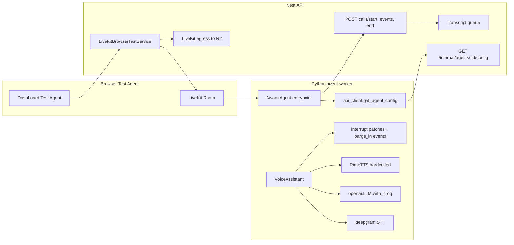

# Phase 5: Multi-Provider TTS Runtime — Implementation Plan

**Status:** Planning only — no code, schema, or worker runtime changes in this document.

**Goal:** Enable live Test Agent (and future SIP) TTS for **Cartesia**, **ElevenLabs**, and **Inworld** while **keeping Rime behavior unchanged**, and without breaking **barge-in**, **call lifecycle**, **browser recording**, or **transcript assembly**.

---

## 1. Current worker architecture summary



| Layer | Responsibility |
|--------|----------------|
| **Dispatch** | API creates room + metadata (`agentId`, `callId`, org) and dispatches LiveKit agent job (`LIVEKIT_AGENT_NAME`). |
| **Config load** | Worker calls `GET /internal/agents/:id/config` with `x-worker-secret`. Today returns flat Rime fields only (`voiceId`, `voiceModelId`, `voiceLang`). |
| **Pipeline** | `VoiceAssistant`: Silero VAD → Deepgram STT → Groq LLM → **custom `RimeTTS`** (`livekit.agents.tts.SynthesizeStream`). |
| **Preemptive TTS** | `preemptive_synthesis=True` — LLM tokens stream into TTS before the full reply is done. |
| **Interruption** | `allow_interruptions=True`; 100 ms `AudioSource` queue patch; custom barge-in monitor flushes queue and cancels in-flight TTS (`asyncio.CancelledError` in `RimeSynthesizeStream`). |
| **Lifecycle** | `CallLifecycle` + `SpeechEventSink` → internal call events; shutdown → `end_call` + `rime.aclose()`. |
| **Recording** | Browser test egress to R2 (`awaaz_browser_test_call`); independent of TTS HTTP implementation. |
| **Transcripts** | STT/LLM text events via internal API → BullMQ transcript assembly — **not** driven by TTS provider. |

**Pinned stack:** `livekit-agents==0.8.11`, custom HTTP Rime adapter (no official Cartesia/ElevenLabs/Inworld plugins in `requirements.txt`).

**Critical API gap (blocks Phase 5 today):**

- `VoicesService.resolveForTts()` rejects any non-Rime `Voice` row.
- `InternalService.getAgentConfig()` depends on that.
- `AgentsService.v1CompatiblePipelineData()` always writes `ttsProviderId: 'rime'` even when `voiceId` is `cartesia:…` / `elevenlabs:…` — **version rows can disagree with the selected catalog voice**.

Phase 4.1 **UI guardrails** block Test Agent / Publish for non-Rime; API publish does not server-enforce.

---

## 2. Files that need changes

### API (`apps/api`)

| File | Change |
|------|--------|
| `src/voices/voices.service.ts` | Add `resolveTtsForRuntime()` (provider-aware); keep `resolveForTts()` for Rime preview path or delegate to shared resolver. |
| `src/internal/internal.service.ts` | Return pipeline + TTS credentials (worker-only); use version `ttsProviderId` / voice row, not Rime-only resolver. |
| `src/agents/agents.service.ts` | `v1CompatiblePipelineData()` must set `ttsProviderId`, `ttsVoiceId`, `ttsModel` from resolved voice (not always Rime). |
| `src/plugins/plugins.service.ts` | Reuse `resolveSecret()` for org + provider when building worker config; fail fast if missing/invalid. |
| `src/livekit/livekit-browser-test.service.ts` (optional) | Pre-dispatch validation: agent's live TTS provider has resolvable credential before room create. |
| `src/internal/` (types/DTO) | Document/typed worker config response (no Prisma schema change). |
| Tests | Internal config contract, resolver per provider, publish + test path with mocked secrets. |

### Worker (`apps/agent-worker`)

| File | Change |
|------|--------|
| `agent.py` | `build_tts(config)` instead of hardcoded `RimeTTS(...)`; log provider id + fingerprint, not keys. |
| `api_client.py` | Parse expanded config JSON. |
| `pipeline/tts.py` | Split or add modules: `rime` (move existing), `cartesia`, `elevenlabs`, `inworld`, `factory.py`. |
| `pipeline/audio.py` (new) | Normalize sample rate/format → LiveKit frames (16 kHz s16le mono baseline). |
| `requirements.txt` | Add `websockets` (Cartesia WS) if not transitive; optional `numpy`/scipy only if resampling needed. |
| `.env.example` / `README.md` | Document migration: TTS keys prefer API payload; env fallback for Rime during rollout. |

### Web (`apps/web`) — after each provider is proven

| File | Change |
|------|--------|
| `lib/agent-runtime-guardrails.ts` | Incrementally allow `cartesia` / `elevenlabs` / `inworld` in `canTestLive` / `canPublishLive`. |
| `agent-editor-client.tsx` | Update footnotes/messages as providers go live. |

**Explicitly out of scope for Phase 5 (per your constraints):** Prisma migrations, STT/LLM multi-provider worker factories (Phase 5+ in V2 plan), billing registry (Phase 6).

---

## 3. Provider API compatibility

| Provider | Auth | Voice ID in DB | Model in DB | API already used (sync) | Runtime API (planned) |
|----------|------|----------------|-------------|-------------------------|------------------------|
| **Rime** | `Authorization: Bearer` | `providerVoiceId` or legacy speaker id | `modelId` (e.g. `mistv2`) | `users.rime.ai/v1/rime-tts` | Same (existing) |
| **Cartesia** | `X-API-Key` + `Cartesia-Version: 2026-03-01` | `cartesia:{uuid}` → native UUID | From sync / voice row | `GET api.cartesia.ai/voices` | **WebSocket** `wss://api.cartesia.ai/tts/websocket` (contexts, `push` / `no_more_inputs`) |
| **ElevenLabs** | `xi-api-key` | `elevenlabs:{id}` → voice_id | Often implicit; optional model id in metadata | `GET api.elevenlabs.io/v2/voices` | **HTTP stream** `POST …/v1/text-to-speech/{voice_id}/stream` or WebSocket multi-context |
| **Inworld** | Basic / API key (per Finova setup) | `inworld:{id}` | `inworld-tts-2` (catalog default) | `GET api.inworld.ai/voices/v1/voices` | **TTS synthesize REST** (discover exact path in spike; likely non-WS first) |

**Stored voice key:** External voices use `rimeVoiceId` column as legacy scoped id (`provider:providerVoiceId`) — worker must use **`providerVoiceId`** + **`providerId`**, not the scoped legacy string, when calling vendor APIs.

**Credential resolution (existing pattern):** Org BYOK decrypt → else `FINOVA_*` env on API → else fail with clear error before dispatch.

---

## 4. Streaming support per provider

| Provider | Vendor streaming model | Fit with `SynthesizeStream` + `preemptive_synthesis` | Audio format notes |
|----------|------------------------|-----------------------------------------------------|-------------------|
| **Rime** | HTTP POST per text chunk; custom buffer + idle flush | **Production-proven** | 16 kHz PCM s16le — baseline |
| **Cartesia** | WS: one **context_id** per assistant turn; token `push`; **new context on interrupt** (vendor guidance) | **Best semantic match** to current stream class | Often `pcm_f32le` @ 44.1 kHz → **resample/downmix to 16 kHz s16le** |
| **ElevenLabs** | HTTP chunked stream or WS; supports `output_format` e.g. `pcm_16000` | **Good** — can mirror Rime's HTTP-chunk pattern with less resampling | Prefer `pcm_16000` to align with Rime/LiveKit path |
| **Inworld** | Likely REST stream or buffered chunks (TBD in spike) | **Weakest** — may need pseudo-stream (sentence/buffer) initially | Confirm sample rate in spike |

**Design rule:** Each adapter implements `tts.TTS` with `streaming=True` and a `SynthesizeStream` that:

1. Accepts incremental `push_text` from the LLM.
2. On `asyncio.CancelledError`, aborts vendor request/context immediately.
3. Emits `rtc.AudioFrame`s at a **single worker-wide sample rate** (recommend **16 kHz mono s16le** to match Rime and minimize egress/transcript timing drift).

---

## 5. Voice preview support per provider

| Provider | Editor preview today | Phase 5 runtime impact |
|----------|----------------------|-------------------------|
| **Rime** | `POST` synthesize via API (`voices.service` preview) | Unchanged |
| **ElevenLabs** | Catalog `previewAudioUrl` from sync (UI plays URL) | No worker change; optional later: on-demand preview API |
| **Cartesia** | Generally no generated preview in UI | Same — catalog-only in UI |
| **Inworld** | Catalog metadata / URL if present | Same |

**Preview ≠ runtime:** Phase 5 does not require worker changes for preview. Optional follow-up: provider-specific preview endpoints using the same adapters as runtime (out of initial Phase 5 scope).

---

## 6. Interruption / cancellation risks

| Risk | Rime today | New providers |
|------|------------|---------------|
| **Stale audio after barge-in** | Cancelled HTTP chunk + 100 ms queue flush | WS context not closed → Cartesia may keep sending; must **close context / cancel task** on `CancelledError` |
| **Preemptive synthesis race** | Multiple chunk requests; cancel prior | ElevenLabs: abort stream reader; Cartesia: **new `context_id`** per interrupt |
| **Sample-rate mismatch** | N/A | Wrong format → garbled audio or slow interrupt drain |
| **Long first-byte latency** | Tuned via `RIME_TTS_FIRST_CHUNK_CHARS` | Per-provider env tuning (mirror pattern) |
| **end_call / final playback drain** | `CallLifecycle` waits for playback | Ensure `tts_active` tracking still accurate when adapter swaps |
| **Double speak after interrupt** | LLM may continue; TTS must ignore cancelled stream output | Guard `SynthesizeStream` with generation token / context id |
| **LiveKit 0.8.11 plugins** | Custom code only | Avoid upgrading agents package in Phase 5 unless spike proves drop-in plugins preserve barge-in |

**Regression bar:** Match or beat current Rime metrics: `interruption_to_silence_ms`, `barge_in_tts_cancellation_requested` logs, no audible overlap on rapid user speech.

**Do not change** in Phase 5 unless measured necessary: `install_livekit_interrupt_patches()`, `register_barge_in_events()`, `preemptive_synthesis=True`.

---

## 7. Required env vars / secrets

### API (Render) — already in catalog

| Provider | Finova managed | BYOK (org credential) |
|----------|----------------|------------------------|
| Rime | `FINOVA_RIME_API_KEY`, `RIME_API_KEY` | Org `ProviderCredential` |
| Cartesia | `FINOVA_CARTESIA_API_KEY`, `CARTESIA_API_KEY` | Same |
| ElevenLabs | `FINOVA_ELEVENLABS_API_KEY`, `ELEVENLABS_API_KEY`, `ELEVEN_API_KEY` | Same |
| Inworld | `FINOVA_INWORLD_API_KEY`, `INWORLD_API_KEY` | Same |

### Worker (Render) — target state after Phase 5

| Variable | Phase 5 role |
|----------|----------------|
| `LIVEKIT_*`, `AWAAZ_API_URL`, `WORKER_SECRET` | Unchanged |
| `DEEPGRAM_API_KEY`, `GROQ_API_KEY` | Unchanged (STT/LLM still env-based in Phase 5) |
| `RIME_API_KEY` | **Fallback** for Rime if internal config omits key; prefer API-delivered secret |
| `CARTESIA_API_KEY` / `ELEVENLABS_API_KEY` / `INWORLD_API_KEY` | **Avoid on worker** long-term — deliver via internal config only (V2 plan) |

**Security:** Log `credentialMode`, `providerId`, key fingerprint/hash in call metadata — never plaintext keys in logs or events.

---

## 8. Runtime config shape (API → worker)

Proposed **backward-compatible** expansion of `GET /internal/agents/:id/config` (worker secret only):

```json
{
  "agentId": "…",
  "agentVersionId": "…",
  "organizationId": "…",
  "systemPrompt": "…",
  "model": "llama-3.3-70b-versatile",
  "temperature": 0.7,
  "maxTokens": 1024,
  "firstMessage": "…",
  "endCallPhrases": ["goodbye"],

  "pipeline": {
    "stt": { "providerId": "deepgram", "model": "nova-2-conversationalai" },
    "llm": { "providerId": "groq", "model": "llama-3.3-70b-versatile" },
    "tts": {
      "providerId": "cartesia",
      "voiceId": "<native-provider-voice-id>",
      "modelId": "sonic-3",
      "language": "en"
    }
  },

  "credentials": {
    "tts": {
      "providerId": "cartesia",
      "mode": "FINOVA_MANAGED",
      "apiKey": "<decrypted-key>",
      "keyFingerprint": "sha256:…"
    }
  },

  "legacy": {
    "voiceId": "<same as today for rime: rime speaker id>",
    "voiceModelId": "mistv2",
    "voiceLang": "eng"
  }
}
```

**Worker mapping:**

- `build_tts(config)` reads `pipeline.tts` + `credentials.tts`.
- For **Rime**, populate `legacy` fields from resolver for zero-drift rollout.
- **Publish guard (recommended):** If `version.ttsProviderId` ≠ voice row `providerId`, reject publish or auto-heal on save (no schema change — data fix in service layer).

**Call metadata** (on `start_call`): add `ttsProviderId`, `ttsModel`, `credentialMode`, `ttsKeyFingerprint`.

---

## 9. Step-by-step implementation phases

| Phase | Deliverable | Exit criteria |
|-------|-------------|---------------|
| **5.0 — Spikes (2–3 days)** | Cartesia WS + ElevenLabs stream + Inworld synthesize prototypes; document formats, latency, cancel behavior | Written notes + 30s demo scripts per provider |
| **5.1 — API contract** | `resolveTtsForRuntime`, fixed `v1CompatiblePipelineData`, expanded internal config + credential resolution | Unit tests; Rime agent config byte-compatible in `legacy` block |
| **5.2 — Worker factory + Rime** | `build_tts()`, move Rime to module, key from config with env fallback | Full Rime regression: Test Agent, interrupt, end_call, recording, transcript |
| **5.3 — Cartesia runtime** | WS `SynthesizeStream` + resampling + cancel | Happy path + barge-in on 2–3 Cartesia voices |
| **5.4 — ElevenLabs runtime** | HTTP (or WS) stream adapter | Same matrix as 5.3 |
| **5.5 — Inworld runtime** | REST adapter (streaming or buffered) | Same matrix; document limitations if not true stream |
| **5.6 — UI guardrails** | Enable publish/test per shipped provider | Remove false "catalog only" warnings for live providers |
| **5.7 — Hardening** | Optional API pre-dispatch credential check; publish-time server guard; observability dashboards | No silent fallback to Rime on wrong provider |

**Order rationale:** API contract before worker so feature flags can deploy API first without breaking Rime (legacy fields). One new provider per PR after Rime refactor.

---

## 10. Test matrix

| # | Scenario | Rime | Cartesia | ElevenLabs | Inworld |
|---|----------|------|----------|------------|---------|
| 1 | Test Agent connect + first message | ✓ baseline | ✓ | ✓ | ✓ |
| 2 | Multi-turn conversation | ✓ | ✓ | ✓ | ✓ |
| 3 | Barge-in during long reply | ✓ | ✓ | ✓ | ✓ |
| 4 | Rapid double barge-in | ✓ | ✓ | ✓ | ✓ |
| 5 | `end_call` tool + final playback drain | ✓ | ✓ | ✓ | ✓ |
| 6 | User manual end during agent speech | ✓ | ✓ | ✓ | ✓ |
| 7 | Idle warning / idle end | ✓ | ✓ | ✓ | ✓ |
| 8 | Max duration shutdown | ✓ | ✓ | ✓ | ✓ |
| 9 | Browser recording in R2 | ✓ | ✓ | ✓ | ✓ |
| 10 | Transcript job completes with USER/AGENT events | ✓ | ✓ | ✓ | ✓ |
| 11 | Missing BYOK + no Finova key → fail before room | N/A | ✓ | ✓ | ✓ |
| 12 | Publish live with provider voice → worker uses correct TTS | ✓ | ✓ | ✓ | ✓ |
| 13 | Draft save non-runtime voice (if still allowed) | UI warning only | — | — | — |
| 14 | Regression: existing prod agents (all Rime versions) | ✓ | — | — | — |
| 15 | Latency: first audio after user turn | baseline | ≤ baseline + 150 ms target | similar | similar |

**Environments:** Local worker + API → staging → production smoke (1 agent per provider, Finova-managed keys).

**Automated:** API contract tests + worker unit tests for cancel/resample; manual browser for interrupt feel.

---

## 11. Recommendation: implement **Cartesia** first

**Implement first: Cartesia**

1. **Interruption model** — Cartesia's WebSocket TTS is designed around **contexts** with explicit guidance to start a **new context after interruption**, which maps directly to your existing `CancelledError` + barge-in flow better than a single long HTTP stream.
2. **Streaming LLM alignment** — `push()` / incremental input matches `RimeSynthesizeStream`'s chunked `push_text` and `preemptive_synthesis` better than batch REST.
3. **Platform readiness** — Production catalog sync (752 voices), credential validation (`cartesia-voices`), and Finova env vars are already wired on the API.
4. **Highest user value** — Largest non-Rime catalog; first provider unlocks the most editor voices.

**Second: ElevenLabs**

- Fastest **audio plumbing** path (`pcm_16000` HTTP stream ≈ Rime's httpx pattern).
- Smallest catalog (24 voices) → easier exhaustive QA.
- Preview URLs already improve editor UX; runtime parity is a strong demo.

**Third: Inworld**

- `local-only` credential validation in catalog.
- Streaming path least documented in-repo; highest discovery risk.
- Ship after patterns from Cartesia + ElevenLabs stabilize `build_tts()` and resampling.

**If the team optimizes for lowest risk over best architecture:** do **ElevenLabs second** only as a **5.3b** shortcut after Rime refactor (before Cartesia) — accept that Cartesia should still be the **first non-Rime provider** in the main sequence above unless you explicitly choose the "minimal audio pipeline" path.

---

## Preconditions (from Phase 0–4.1 verification)

- Migrations and plugin catalog are live; voice counts synced.
- UI guardrails prevent broken Test Agent for non-Rime until Phase 5.6.
- **Before coding:** fix `v1CompatiblePipelineData` / resolver inconsistency so published versions record the true `ttsProviderId`.

---

## Explicit non-goals (this plan)

- No Prisma schema changes.
- No worker STT/LLM provider factories.
- No LiveKit Agents version bump (unless 5.0 spike blocks Cartesia).
- No code changes in this step.

When you want to start implementation, the suggested first PR is **5.1 API contract + Rime-compatible internal config**, then **5.2 worker factory** with zero behavior change, then **5.3 Cartesia**.

---

## Related documents

- [Awaaz_V2_Plan.md](./Awaaz_V2_Plan.md) — overall V2 phases
- [apps/agent-worker/README.md](./apps/agent-worker/README.md) — current worker pipeline
- [ARCHITECTURE.md](./ARCHITECTURE.md) — platform architecture
