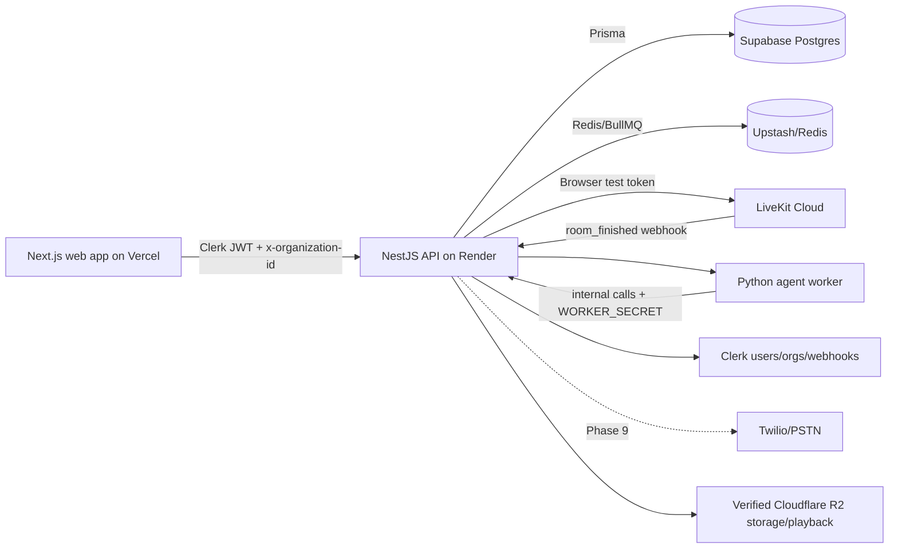

# Awaaz V1 Platform

Awaaz V1 is a multi-tenant AI voice agent platform for configuring agents, running browser-based LiveKit test calls, reviewing call history, and monitoring analytics/settings for organizations.

Current verified scope: non-Twilio dashboard and browser test-call flow through Phase 8.7, with Phase 8.3 free-tier survival setup prepared for manual UptimeRobot configuration. Cloudflare R2 storage, presigned playback URLs, CORS/range requests, and WaveSurfer browser playback readiness are verified. Twilio/PSTN calls, Twilio recording ingestion into R2, real call recording lifecycle, and production worker deployment remain deferred to Phase 9.

## Architecture



## Apps

- `apps/web`: Next.js dashboard, Clerk auth, agents, calls, analytics, phone numbers, settings, Qualicall placeholder.
- `apps/api`: NestJS API, Prisma, Clerk auth/webhooks, LiveKit browser test support, analytics, API keys, org/member management.
- `apps/agent-worker`: Python LiveKit agent worker and health server.
- `apps/qualicall-worker`: placeholder worker area for future Qualicall work.

## Verified Non-Twilio Features

- Agents list/editor/version history/publish flow.
- Browser LiveKit test calls that create completed Test call rows.
- Call history and call detail with transcript, costs, latency, and graceful recording fallback.
- Analytics with real non-test data and test-call exclusion.
- Phone number assignment and LiveKit dispatch-rule sync.
- Members invite/accept flow.
- API key prefix/hash/one-time reveal/revoke lifecycle.
- Organization name persistence.
- Qualicall placeholder.
- Cloudflare R2 bucket `awaaz-recordings`, upload/download, HeadObject, presigned HEAD/GET/range, CORS headers, bytes-matched WAV retrieval, WaveSurfer readiness, and recording endpoint compatibility.
- Phase 8.2 non-Twilio security audit and 8.6 database verification.

## Known Backlog

- `New Agent` create UI is intentionally disabled. The API exists, but the dashboard create flow is not wired yet.

## Phase 9 Deferrals

- Twilio/PSTN inbound and outbound real calls.
- Twilio webhook production flow.
- Twilio/PSTN recording ingestion into the verified R2 bucket.
- Real call recording lifecycle and playback for actual PSTN recordings.
- Live PSTN worker hardening and production recording verification.

## Local Development

Requirements:

- Node.js `>=20 <21`
- pnpm `>=9`
- Supabase Postgres
- Clerk app
- LiveKit project
- Redis/Upstash for queue-backed flows

Setup:

```powershell
pnpm install
Copy-Item .env.example .env
pnpm --filter @awaaz/api prisma:validate
pnpm --filter @awaaz/api prisma:deploy
pnpm --filter @awaaz/api prisma:seed
```

Run locally:

```powershell
pnpm dev:api
pnpm dev:web
```

Useful checks:

```powershell
pnpm --filter web lint
pnpm --filter web build
pnpm --filter @awaaz/api build
pnpm --filter @awaaz/api prisma:validate
git diff --check
```

## Deployment

See [DEPLOYMENT.md](./DEPLOYMENT.md).

Free-tier survival:

- Monitor the Render API health endpoint every 10 minutes: `https://awaaz-api-nxae.onrender.com/health`.
- Monitor the deployed Vercel web URL every 10 minutes once the final production URL is selected.
- Keep `/internal/worker/heartbeat` private; it requires `x-worker-secret` and should not be used as a public UptimeRobot URL.
- Skip public Supabase keepalive monitors for now unless a safe credential-free endpoint is intentionally added.

## Troubleshooting

See [TROUBLESHOOTING.md](./TROUBLESHOOTING.md).
